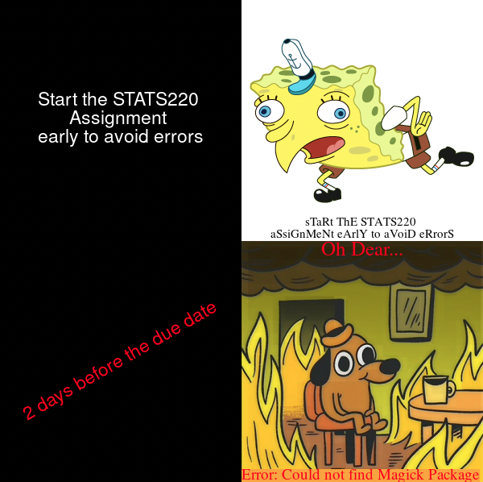

# *✨Welcome to Simran's STATS220 Repository!✨*

- You can read more about me [*here!*](https://github.com/simranwadhawan/stats220/blob/main/README.md)
- Feel free to explore my GitHub [*here!*](https://github.com/simranwadhawan/stats220)
- This website will showcase my orginal meme that I created for Part A of Assignment 1 for STATS220

## ✨Here's the meme I made✨:



I made this meme using the R package [{magick}](https://cran.r-project.org/web/packages/magick/vignettes/intro.html).


## ✨The motivation/inspiration behind the meme✨:

This meme is based on a real life story (AKA mine), and there are a couple of reasons why I wanted to showcase this.
Unfortunately, I was very busy with my other assignments and quizzes last week, therefore, I thought I would give Assignment 1 of STATS220 on Sunday (A day before the due date). I was pretty confident that my code would work seamlessly, so I started my amazing sunday with the assignment. However, I kept getting errors when I tried creating my meme - especially with magick function [image_annotate()]. I started stressing out, as I thought that I was the only person haing this issue and it's too late for anyone to help me. I was in a state of panic and I couldn't find any way out!

Eventually, I thought of going on to the ED Discussion board, only to see that mutliple people were having this issue (especially those with Macs) - which was relieving! Hence, I had to use R Studio Cloud for my Assignment - as per Anna's advice. 

Now that my code was working, I thought, why not explain/convey what I just went through (an emotional rollercoaster) with a meme - there's no better way!

And that's how I got my motivation. In terms of inspiration of what meme templates and characters to choose from, that was easy.
1. I first thought of who and which meme would be the perfect visual example to show how confident I was that 1 day would be enough for the assignment - obviously my favourite "mocking spongebob" meme! 
2. I then had to think of another character/meme that perfectly showed my regret and feelings in the exact moment where I realised I made a big mistake by not starting early and resolving any issues that may arise- I just knew that the burning dog would be the perfect example.

This meme, really takes me back to the moment of panic and frustration. However, I can definetley say that I made it! 


## ✨My R Code for My Meme!✨
```
library(magick)
#Blank Square one
Ontime<- image_blank(width=300,
                     height=300,
                     color="#000000")%>%
  image_annotate(text = "Start the STATS220 
Assignment 
early to avoid errors",
                 color="#FFFFFF",
                 size=23,
                 font="Impact",
                 gravity = "Center")

#Square Two
spongebob <- image_read("https://i.pinimg.com/originals/b9/3d/11/b93d1136472184899cfc5052a3991658.png")%>%
  image_scale(300)%>%
  image_annotate(text = "sTaRt ThE STATS220 
aSsiGnMeNt eArlY to aVoiD eRrorS",
                 color="#000000",
                 size=15,
                 font="Times",
                 gravity = "south")
           
#Square Three
Late<- image_blank(width=300,
                   height=300,
                   color="#000000")%>%
  image_annotate(text = "2 days before the due date",
                 degrees = -30,
                 color="#FF0015",
                 size=23,
                 font="Impact",
                 gravity = "Center")     


#The Dog
Dog <- image_read("https://www.meme-arsenal.com/memes/2a2d80ff28c191d6edf13c1b58d53841.jpg")%>%
  image_scale(300)%>%
  image_annotate(text = "Oh Dear...",
                 color="#FF0015",
                 size=25,
                 font="Times",
                 gravity = "North")%>%
  image_annotate(text = "Error: Could not find Magick Package",
                 color="#FF0015",
                 boxcolor = "#F9A631",
                 size=19,
                 font="times",
                 gravity = "southwest")


#Creating the rows
first_row<- c(Ontime, spongebob)%>%
  image_append()

second_row<- c(Late, Dog)%>%
  image_append()

#Merging the rows
meme<-c(first_row, second_row)%>%
  image_append(stack = TRUE)

meme

image_write(meme, "my_meme.png")

```
